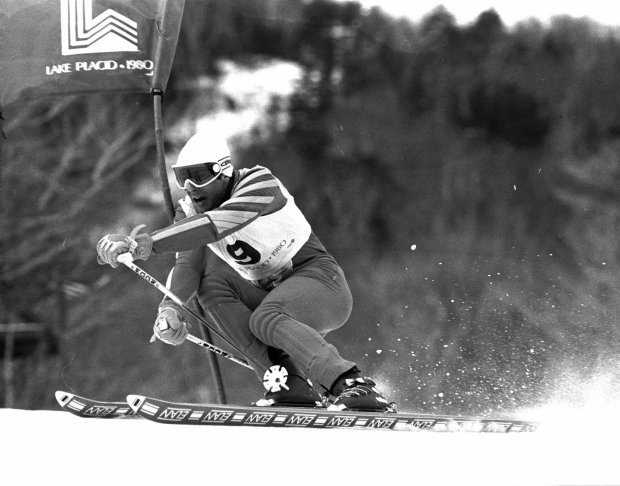

```{r setup, echo=FALSE, results='hide', warning=FALSE, message= FALSE}
# Če želimo nastaviti pisave v PDF-ju, odkomentiramo
# in sledimo navodilom v programu.
#source("fontconfig.r", encoding = "UTF-8")

# Uvoz vseh potrebnih knjižnic
source("lib/libraries.r", encoding = "UTF-8")
```

# Izbira teme

Za temo projekta sem si izbrala svetovni pokal v alpskem smučanju, saj ta šport spremljam že od malih nog in bi ga rada predstavila ter približala tudi ostalim.


***

<center>



</center>

***

# Obdelava, uvoz in čiščenje podatkov

```{r uvoz, echo=FALSE, message=FALSE, warning=FALSE}
source("uvoz/uvoz.r", encoding = "UTF-8")
source("vizualizacija/vizualizacija.r", encoding ="UTF-8")
```

Podatke sem uvozila iz [Wikipedije](https://en.wikipedia.org/wiki/FIS_Alpine_Ski_World_Cup) in [SKI-DB](http://www.ski-db.com/worldcup.php) v obliki HTML. Iz prve spletne strani sem pridobila delne podatke o zmagovalcih posameznih sezon, podatke o malih kristalnih globusih v posameznih disciplinah in podatke o državah, ki imajo vsaj kakšno zmago v svetovnem pokalu. Iz druge povezave pa sem pridobila še ostale podatke o zmagovalcih. K temu sem dodala še podatke o prizoriščih prav tako iz [SKI-DB](http://www.ski-db.com/db/loc/main.php). Za konec pa sem uporabila še [Eurostat](http://appsso.eurostat.ec.europa.eu/nui/show.do?query=BOOKMARK_DS-471197_QID_-361F748D_UID_-3F171EB0&layout=TIME%2CC%2CX%2C0%3BGEO%2CL%2CY%2C0%3BUNIT%2CL%2CZ%2C0%3BSECTOR%2CL%2CZ%2C1%3BCOFOG99%2CL%2CZ%2C2%3BNA_ITEM%2CL%2CZ%2C3%3BINDICATORS%2CC%2CZ%2C4%3B&zSelection=DS-471197INDICATORS%2COBS_FLAG%3BDS-471197UNIT%2CPC_TOT%3BDS-471197SECTOR%2CS13%3BDS-471197COFOG99%2CGF08%3BDS-471197NA_ITEM%2CTE%3B&rankName1=UNIT_1_2_-1_2&rankName2=SECTOR_1_2_-1_2&rankName3=INDICATORS_1_2_-1_2&rankName4=NA-ITEM_1_2_-1_2&rankName5=COFOG99_1_2_-1_2&rankName6=TIME_1_0_0_0&rankName7=GEO_1_2_0_1&sortC=ASC_-1_FIRST&rStp=&cStp=&rDCh=&cDCh=&rDM=true&cDM=true&footnes=false&empty=false&wai=false&time_mode=FIXED&time_most_recent=false&lang=en&cfo=%23%23%23%2C%23%23%23.%23%23%23%20) v obliki CSV in sicer za pregled o porabi sredstev države za področje športa. Podatki so prikazani v šestih razpredelnicah v obliki *tidy data*.


1. `zmagovalci.slo` - podatki o zmagovalcih od leta 1966 do leta 2016
  * `sezona` - spremenljivka:  sezone od 1966 do 2016 (numeric),
  * `spol` - spremenljivka: moški(M) ali ženski(Z) (factor),
  * `zmagovalec` - spremenljivka: ime in priimek športnika (character),
  * `narodnost` - spremenljivka: narodnost športnika (character),
  * `tocke` - meritev: dosežene točke v določeni sezoni za športnika (numeric),
  * `starost` - meritev: starost v določeni sezoni za športnika (numeric).

```{r zmagovalci.slo, echo=FALSE, message=FALSE}
kable(head(zmagovalci.slo), align="cccccc")
```


2. `discipline.slo` - podatki o dobitnikih največ malih kristalnih globusov
  * `disciplina` - spremenljivka: 5 disciplin alpskega smučanja (character),
  * `spol` - spremenljivka: moški(M) ali ženski(Z) (factor),
  * `smucar` - spremenljivka: ime in priimek športnika (character),
  * `narodnost` - spremenljivka: narodnost športnika (character),
  * `naslovi` - meritev: število naslovov za najboljše po disciplinah (numeric).

```{r discipline.slo, echo=FALSE, message=FALSE}
kable(head(discipline.slo), align="ccccc")
```


3. `narodi1.slo` - podatki o zmagah posameznih držav
  * `drzava` - spremenljivka:  države, ki imajo vsaj kakšno zmago v pokalu (character),
  * `spol` - spremenljivka: moški ali ženski ali ekipno (factor),
  * `zmage` - meritev: število zmag posamezne države glede na spol (numeric).

```{r narodi1.slo, echo=FALSE, message=FALSE}
kable(head(narodi1.slo), align="ccc")
```

  
4. `prizorisca1.slo` - podatki o prizoriščih tekem (mesto in država)
  * `prizorisce` - spremenljivka:  mesto, kjer je že bila tekma (character),
  * `kratica` - spremenljivka: okrajšava za mesto (character),
  * `drzava` - meritev: država, kjer se nahaja mesto tekme (character).

```{r prizorisca1.slo, echo=FALSE, message=FALSE}
kable(head(prizorisca1.slo, align="ccc"))
```


5. `prizorisca2` - podatki o številu tekem na posameznem prizorišču
  * `kratica` - spremenljivka:  okrajšava za mesto (character),
  * `spol` - spremenljivka: moški ali ženski (factor),
  * `tekme` - meritev: število tekem glede na spol (numeric).

```{r prizorisca2, echo=FALSE, message=FALSE}
kable(head(prizorisca2), align="ccc")
```

6. `bdp.slo` - izdatki države (delež BDP) za področje športa za obdobje 2000-2016
  * `leto` - spremenljivka:  leta od 2000 do 2016 (integer),
  * `drzava` - spremenljivka: evropske države (character),
  * `delez` - meritev: delež bdp za posamezno državo (numeric).

```{r bdp.slo, echo=FALSE, message=FALSE}
kable(head(bdp.slo), align="ccc")
```

***


# Analiza in vizualizacija podatkov

```{r vizualizacija, echo=FALSE, message=FALSE, warning=FALSE}
source("vizualizacija/vizualizacija.r", encoding = "UTF-8")
```

Pri analizi podatkov sem si pomagala s štirimi grafi in tremi zemljevidi. Njihov pomen in razlago bom predstavila spodaj.
Preden sem začela s projektom, sem si postavila nekaj hipotez oziroma ideje, ki se tičejo svetovnega pokala v alpskem smučanju. Ker tudi sama spremljam ta šport že nekaj let, je bilo to seveda lažje narediti. In sicer: zdelo se mi je, da bodo najboljši smučarji/-ke večinoma Evropejci/-ke, ker je smučanje tukaj bolj razvito oziroma popularno in tudi pogoji so boljši(podnebje, število smučišč itd.) ter da bodo mlajši športniki uspešnješi; zmagovalci večih sezon so ponavadi dobri v več kot eni disciplini, zato sem imela občutek, da se bo njihovo ime pojavilo tudi pri malih kristalnih globusih. Med najboljšimi državami sem pričakovala države osrednje evrope kot je npr. Avstrija, Italija, Francija zaradi že prej omenjenih razlogov. Kar pa se tiče prizorišč: ker je smučanje najbolj popularno v Evropi, naj bi bila tudi večina tekem tukaj. Na te hipoteze sem najboljše odgovore dobila iz grafov in zemljevidov.


Prvi in drugi graf prikazujeta karakteristike zmagovalcev posameznih sezon glede na spol (starost in točke).
V prvem grafu vidimo, da starost zmagovalcev očitno ne igra velike vloge ne pri ženskah ne pri moških, ker starosti očitno zelo nihajo. od sredinskih vrednosti nabolj odstopata Avstrijka Annemarie Pröll, ki je leta 1970 uspela dobiti skupni seštevek pri rosnih 17, in Avstrijec Stephan Eberharter s 33 leti. Kjer vrednosti naraščajo linearno pomeni, da je isti smučar dobil več sezon zapored in bil logično eno leto starejši - npr. Marcel Hirscher.

```{r graf3 , echo=FALSE, message=FALSE, fig.align='center' }
print(graf3)
```


Z drugim grafom sem želela prikazati dosežene točke zmagovalcev. Na začetku se mi je zdelo, da razlik med moškimi in ženskami praktično ne bo. To je bilo res do leta 1991, potem pa se je točkovanje spremenilo - posamezna mesta so prinesla več točk. Tukaj se je začelo prepletanje - do leta 2007, ko sta imela Vonn in Miller skoraj enake točke. Vidimo pa lahko tudi, da so od takrat naprej ženske dosti boljše v pridobivanju točk in dobrih rezultatov, saj so bolj univerzalne in vozijo v večih disciplinah. Višek je dosegla Tina Maze leta 2012 s 2414 točkami in tako postavila nov mejnik.

```{r graf2 , echo=FALSE, message=FALSE, fig.align='center' }
print(graf2)
```


Tretji graf prikazuje najboljše smučarje/-ke glede na disciplino. Tudi tukaj se mi je zdelo, da nekako ne bo velike razlike med spoloma. Vendar lahko vidimo, da v pridobljenih malih kristalnih globusih izstopata Vonn in Stenmark. Nadvlado v tehničnih disciplinah imajo moški, v hitrih pa ženske, glede zmnožnosti tako dobrega nastopanja skozi več let.

```{r graf4 , echo=FALSE, message=FALSE, fig.align='center' }
print(graf4)
```


V zadnjem grafu pa sem hotela predstaviti zmage po državah glede na spol. Zelo lepo se vidi, da je Avstrija najmočnejša država v alpskem smučanju po številu zmag, kar sem tudi pričakovala. Med boljšimi pa so tudi ostale države osrednje Evrope in sicer Švica, Francija in Italija kot napovedano. Vse te države imajo lego ob Alpah, kar igra ogromno vlogo, saj imajo zelo dobre pogoje za treninge - smučanje je seveda bolj popularno tam, kjer se ga da izvajati. Edina država izven Evrope pa je še ZDA, ki se lahko kosa z ostalo Evropo. Skoraj povsod so k zmagam največ prispevali moški, Avstrija pa ima enako močno moško in žensko zasedbo.

```{r graf1 , echo=FALSE, message=FALSE, fig.align='center' }
print(graf1)
```


Da bi se res videlo, katere države imajo najmočnejše smučarje/-ke oziroma zmagovalce sezon, sem to še predstavila z zemljevidom. Tukaj se lepo vidi, da je Evropa zares vodilna sila v tem športu. Sledi še ZDA, ostale celine pa so po pričakovanjih v senci. To ima seveda največ opraviti z geografskimi pogoji za smučanje in pa tudi z ekonomskim položajem države - če reprezentanca nima dovolj sredstev, je tudi treniranje manj uspešno.

```{r zem.zmagovalci, echo=FALSE, message=FALSE, fig.align='center'}
print(zem.zmagovalci)
```


V drugem zemljevidu pa lahko vidimo, kje se tekme sploh odvijajo in kako pogosto. Kot že napovedano, je največ prizorišč za tekme spet v osrednji Evropi in ZDA ter Kanadi, kjer je smučanje tudi bolj ravito in podnebje primerno. Nekaj tekem pa so priredili celo na južni polobli in sicer v Argentini, Avstraliji in na Novi Zelandiji. Športniki velikokrat tam trenirajo zaradi dobrih geografskih pogojev v gorah, tekme pa so ravno zato lahko tudi izpeljali.

```{r zem.prizorisca, echo=FALSE, message=FALSE, fig.align='center'}
print(zem.prizorisca)
```

***

Za konec sem želela pogledati povezavo med uspešnostjo posameznih držav in vlaganjem teh držav oziroma vlade v področje športa in rekreacije. Zanimalo me je, če ima več vloženega kapitala vlogo pri razvoju športa in kako velika je. Pri tem delu analize sem pregledale podatke iz Eurostata glede na delež BDP in sicer za šport na splošno ne le za smučanje. Podatke sem poiskala le za Evropo, ker je po prejšnjih ugotovitvah tu smučanje najbolj razvito in večina najboljših smučarjev je Evropejcev.

```{r zem.bdp, echo=FALSE, message=FALSE, fig.align='center'}
print(zem.bdp)
```

Za analizo sem vzela le leto 2015, ker je to najbolj aktualno leto s podatki za skoraj vse države EU. Iz zemljevida lahko razberem, da države osrednje Evrope športu namenijo razmeroma majhen delež glede na BDP. Smučarske velesile kot so Avstrija, Italija, Nemčija so pravzaprav kar na dnu te lestvice. Glede na to, da so najuspešnejši smučarji/-ke ravno iz tega dela Evrope je to kar presenetljivo. Iz tega lahko sklepam, da ima kapital za šport manjšo vlogo pri doseganju rezultatov, pomembni so tudi geografski pogoji in pa sam talent in zmožnosti teh športnikov kot sem omenila že zgoraj. Natančnejšo analizo vpliva kapitala namenjenega smučanju bi lahko naredila le s podatki o tem, koliko denarja dobi posamezna smučarska zveza - žal pa ti podatki niso tako zelo javno dostopni.

***

# Povzetek

Skozi izdelavo tega projekta sem pridobila kar nekaj novih znanj na področju smučanja in razumevanju določenih dejavnikov, ki vplivajo na svetovni pokal in rezultate.

<center>


</center>

Celotno raziskavo lahko povzamem nekako takole. Velike razlike med spoloma v tem športu ni, prav tako starost ni nek pomemben dejavnik. Lahko bi celo rekla, da bodo tisti pravi zmagovalci, ki so konstantni že več sezon, še nekaj časa na vrhu lestvic kljub starosti. Oprema je skozi čas napredovala, izkušnje pa prav tako naredijo svoje. Poleg tega pa imam občutek, da Tinin točkovni rekord ne bo zdržal prav dolgo, saj je v zadnjem času vse več univerzalnih smučarjev v vseh disciplinah, ki si želijo večjih uspehov v svetovnem pokalu - veliki kristalni globus. Mislim, da smučanje ne bo več dolgo samo evropska specialiteta. Ravno taki dogodki, kot so letošnje zimske olimpijske igre in možnost spremljanja po celem svetu, šport zelo približajo mladim iz celega sveta in jim dajo željo biti kot vsi veliki zmagovalci.

***